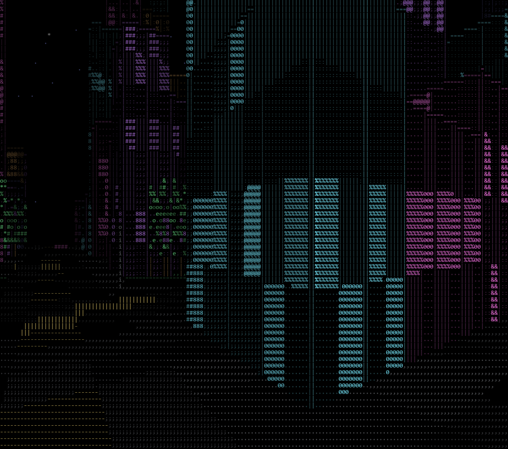
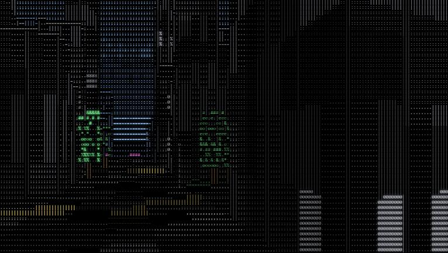

# ASCII City

A walkable cyberpunk city rendered entirely in ASCII characters. Custom raycast
engine in vanilla JavaScript + Canvas 2D — no game engine, no 3D models, no
textures, no shaders. Ships as a single HTML file.




## Run

Open `dist/index.html` in a browser. That's it — the file is self-contained.

**Controls:** WASD move · arrow keys turn · Shift run · click the canvas for
free mouse-look (full vertical range) · **N** day/night · **M** mono/color ·
**F** fullscreen. The character grid sizes itself to the window.

Default look: uniform grayscale, buildings as plain shaded boxes (`MONO`/`FLAT`
in `js/config.js`), spherical white-to-blue sky gradient. The 192² world is a
96² city core surrounded by open plains you can walk out into.

## How it works

- The world is a seeded procedural grid (`js/world.js`): a road lattice with
  lane markings and sidewalks carves the map into blocks; blocks fill with
  building footprints of varying height, plazas, and trees.
- Every frame, a DDA raycaster (`js/renderer.js`) marches one ray per screen
  column through the grid. Perpendicular hit distance drives perspective and
  scale; front-to-back column clipping handles occlusion between buildings of
  different heights. Floor casting fills the ground, billboard projection
  draws cars and pedestrians with a per-cell depth buffer.
- Tree foliage is transparent: dithered glyph coverage that doesn't advance
  the occlusion clip, so the world shows through the gaps.
- Everything reduces to (glyph, color, depth) in a character-cell framebuffer.
  Brightness flows through a single composable stage (`Renderer.shade`):
  base × sunlight × AO × distance term. Brightness picks the glyph and palette
  level; bright glyphs get a bloom pass.
- Lighting is baked at generation time (`js/light.js`): a per-cell shadow-height
  map (march toward the sun; a point is sunlit iff above the map) gives
  directional shadows for one array lookup per sample, and neighbor-occupancy
  AO darkens building bases, alleys, and under-tree areas. Day mode adds a
  dithered sky gradient with a sun disc, desaturates buildings to concrete
  gray, and fades distance toward bright haze (aerial perspective) instead of
  black; night keeps the neon palette, lit windows, and starfield.
- One batched `fillText` per same-color run per row keeps the draw pass fast
  (~6.5 ms/frame at 150×68 characters).

## Development

Source is split into plain scripts under `js/`, loaded by `index.html` in
order (shared global scope, no modules, no build step needed for dev — just
serve the folder and open it).

```bash
node build.js
```

inlines all scripts into `dist/index.html` for release.

## Project docs

See [PRD.md](PRD.md) for scope, decisions, and the feature backlog
(day/night cycle, water, sunlight + AO, audio).
